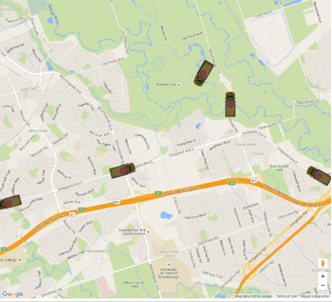

# GPS_TTC_buses
Old hack. Plots locations of TTC buses on a Google map using NextBus API service.

This particular version plots TTC bus #85 that runs on Sheppard ave.

The "truck" image represents the bus. The red-blue circle overlay was an attempt to communicate last updated status. The buses send gps updates roughly every 20 seconds and therefore create a lag in actual position, hence the overlay would help with making decisions on how precise the particular position is.